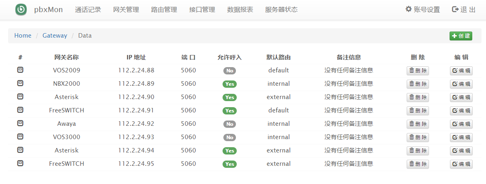

基于 FreeSWITCH 的录音与转码平台，支持 G729, G711 转码，并且支持多接口接入部署。

#### 依赖包及环境

- php 5.4
- Yaf 2.3.5
- Redis 3.2
- MariaDB 5.5
- phpredis 3.1.2
- FreeSWITCH 1.6.15
- mod_g729 1.0.3
- CentOS 7.3

#### pbxMon 功能与特性

- 支持 G729 转码
- 实时录音查询系统
- 支持多 sofia 接口接入
- 支持网关独立拨号路由表
- 网关数据统计报表查询
- 采用 restful 接口存储话单
- 采用 mod_json_cdr 模块推送话单

#### 相关目录说明:

    cdr             通话记录 API 接口，安装位置 /var/cdr
    www             后台 Web 管理系统，安装位置 /var/www
    config          Nginx、PHP 、MySQL 和 FreeSWITCH 的配置文件
    script          MySQL 数据库表 SQL 文件

#### 安装方法

    $ yum -y install epel-release
    $ yum makecache fast
    $ yum install -y gcc gcc-c++ autoconf automake libtool wget python ncurses-devel zlib-devel ldns-devel
    $ yum install -y openssl-devel libevent libevent-devel sqlite-devel libcurl-devel pcre-devel libxml2-devel
    $ yum install -y libdb4* libidn-devel unbound-devel libuuid-devel lua-devel libsndfile-devel libjpeg-devel
    $ yum install -y speex-devel libedit-devel e2fsprogs-devel gsm gsm-devel re2c redis mariadb mariadb-server
    $ yum install -y nginx php php-fpm php-devel php-pdo php-mysql php-mysqli php-mcrypt php-mbstring 

内核配置 /etc/sysctl.conf

    net.ipv6.conf.all.disable_ipv6 = 1
    net.ipv6.conf.default.disable_ipv6 = 1
    net.ipv4.ip_forward = 1
    net.ipv4.tcp_syncookies = 1
    net.ipv4.tcp_tw_reuse = 1
    net.ipv4.tcp_tw_recycle = 1
    net.ipv4.tcp_fin_timeout = 30
    fs.file-max = 2048000
    fs.nr_open = 2048000
    fs.file-max = 1024000
    fs.aio-max-nr = 1048576

内核配置 /etc/security/limits.conf

    * soft    nofile  1024000
    * hard    nofile  1024000
    * soft    nproc   unlimited
    * hard    nproc   unlimited
    * soft    core    unlimited
    * hard    core    unlimited
    * soft    memlock unlimited
    * hard    memlock unlimited

创建 pbx 运行用户组，并下载 pbxMon 源码包

    $ groupadd pbx
    $ usermod -g pbx nginx
    $ git clone https://github.com/typefo/pbx-mon.git

编译安装 FreeSWITCH

    $ wget http://files.freeswitch.org/freeswitch-releases/freeswitch-1.6.15.tar.gz
    $ tar -xzvf freeswitch-1.6.15.tar.gz
    $ cd freeswitch-1.6.15
    $ emacs modules.conf
    $ ./configure --disable-debug --disable-libyuv --disable-libvpx
    $ make
    $ make install
    $ ln -s /usr/local/freeswitch/bin/fs_cli /usr/bin/fs_cli
    $ ln -s /usr/local/freeswitch/bin/freeswitch /usr/bin/freeswitch

安装 ESL PHP 模块

    $ cd libs/esl
    $ make phpmod
    $ cp php/ESL.so /usr/lib64/php/modules

安装 G729 语音模块

    $ git clone https://github.com/typefo/mod_g729.git
    $ cd mod_g729
    $ make
    $ make install

安装 phpredis

    $ git clone https://github.com/phpredis/phpredis.git
    $ cd phpredis
    $ phpize
    $ ./configure
    $ make
    $ make install

安装 yaf 框架

    $ wget https://pecl.php.net/get/yaf-2.3.5.tgz
    $ tar -xzvf yaf-2.3.5.tgz
    $ cd yaf-2.3.5
    $ phpize
    $ ./configure
    $ make
    $ make install

导入数据库表

    $ mysql < script/db.sql
    $ redis-cli < script/config.txt

安装 Web 平台系统

    $ make install

#### 默认 Web 后台账号/密码:

    Account : admin
    Password: pbxmon

